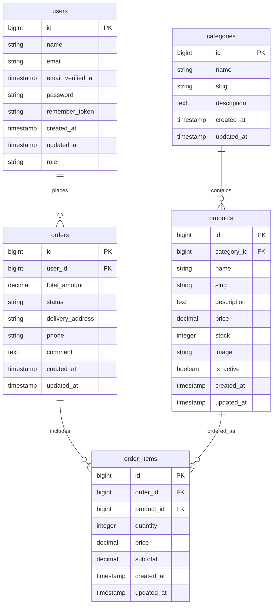

# ER-диаграмма базы данных pet-shop

```mermaid
erDiagram
    users ||--o{ orders : places
    categories ||--o{ products : contains
    orders ||--o{ order_items : includes
    products ||--o{ order_items : ordered_as

    users {
        bigint id PK
        string name
        string email
        timestamp email_verified_at
        string password
        string remember_token
        timestamp created_at
        timestamp updated_at
        string role
    }

    categories {
        bigint id PK
        string name
        string slug
        text description
        timestamp created_at
        timestamp updated_at
    }

    products {
        bigint id PK
        bigint category_id FK
        string name
        string slug
        text description
        decimal price
        integer stock
        string image
        boolean is_active
        timestamp created_at
        timestamp updated_at
    }

    orders {
        bigint id PK
        bigint user_id FK
        decimal total_amount
        string status
        string delivery_address
        string phone
        text comment
        timestamp created_at
        timestamp updated_at
    }

    order_items {
        bigint id PK
        bigint order_id FK
        bigint product_id FK
        integer quantity
        decimal price
        decimal subtotal
        timestamp created_at
        timestamp updated_at
    }
```
